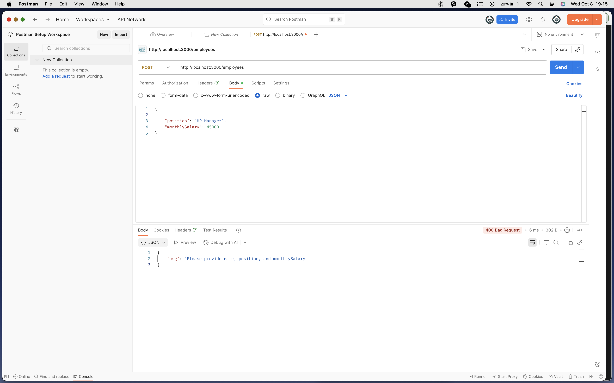

## SweldoSync Employee API
This repository contains a simple, working Node.js API for the SweldoSync project. It manages employee records, which is foundational for payroll and payslip generation.

## Overview
- **API Name**: SweldoSync Employee API
- **Purpose**: Create and retrieve employee records for Philippine SMEs payroll workflows.

## Tech Stack
- **Runtime**: Node.js
- **Framework**: Express.js
- **Database**: MongoDB via Mongoose ODM

## Quick Start
1. **Clone**
   - `git clone <your-repo-url>`
   - `cd ecommerce/product-api`
2. **Install dependencies**
   - `npm install`
3. **Environment**
   - Create a file named `.env` inside `product-api/` with:
```bash
MONGO_URI=mongodb+srv://<user>:<password>@cluster0.xxxxx.mongodb.net/yourDatabaseName?retryWrites=true&w=majority
PORT=3000
```
4. **Run**
   - `node index.js`
   - Server runs at `http://localhost:3000`

## Endpoints

### 1) Create a New Employee
- **Method**: POST
- **Path**: `/employees`
- **Description**: Adds a new employee record.
- **Request Body** (`application/json`):
```json
{
  "name": "Maria dela Cruz",
  "position": "HR Manager",
  "monthlySalary": 45000
}
```
- **Success (201 Created)**:
```json
{
  "_id": "6341a0b3e8b1c8a4c8a8e8b1",
  "name": "Maria dela Cruz",
  "position": "HR Manager",
  "monthlySalary": 45000,
  "hireDate": "2025-10-08T12:00:00.000Z",
  "__v": 0
}
```
- **Error (400 Bad Request)**:
```json
{ "msg": "Please provide name, position, and monthlySalary" }
```

### 2) Get an Employee by ID
- **Method**: GET
- **Path**: `/employees/:id`
- **Description**: Retrieves a single employee by MongoDB `_id`.
- **URL Param**: `id` (string, required)
- **Success (200 OK)**:
```json
{
  "_id": "6341a0b3e8b1c8a4c8a8e8b1",
  "name": "Maria dela Cruz",
  "position": "HR Manager",
  "monthlySalary": 45000,
  "hireDate": "2025-10-08T12:00:00.000Z",
  "__v": 0
}
```
- **Error (404 Not Found)**:
```json
{ "msg": "Employee not found" }
```

## Testing Evidence
The API was tested using Postman for happy paths and error paths.

### Test 1: Create Employee (Happy Path)
- **Action**: POST `/employees` with valid JSON.
- **Result**: `201 Created` and the new employee object.
- **Screenshot**:
  

### Test 2: Create Employee (Error Path)
- **Action**: POST `/employees` with missing `name`.
- **Result**: `400 Bad Request` with validation message.
- **Screenshot**:
  

### Test 3: Get Employee (Happy Path)
- **Action**: GET `/employees/:id` using a valid ID from Test 1.
- **Result**: `200 OK` with the correct employee object.
- **Screenshot**:
  

### Test 4: Get Employee (Error Path)
- **Action**: GET `/employees/:id` using a malformed or non-existent ID.
- **Result**: `404 Not Found` with error message.
- **Screenshot**:
  
